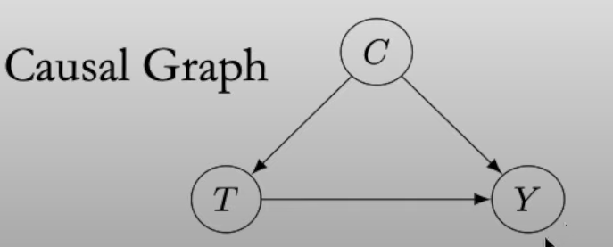

```{r setup, include=FALSE}
knitr::opts_chunk$set(echo = FALSE)
```

In this post we preview the course on Causal Inference. This post will give a brief overview of the main concepts.

## What is causal inference?

- Inferring the effects of any treatment/policy/intervention/ect.

- Examples:

  * Effect of treatment on a disease
  * Effect of climate change policy on emissions
  * Effect of social media on mental health
  * In general, effect of $X$ on $Y$.

## Motivating Example

Suppose we have some disease we are tying to treat with treatment A and treatment B. Our only goal is minimizing death. Suppose treatment B is much more scarce than treatment A. 

  - Treatment T: A (0) and B (1)
  - Condition C: mild (0) or severe (1)
  - Outcome Y  : alive (0) dead (1) 
  
#### Data at Treatment Level

|Treatment|   Total    |
|---------|------------|
|   A     |240/1500 16%|
|   B     |105/550  19%|


- Note this column is just $\mathbb{E}[Y \vert T]$

- On average 16% (240 out of 1500) died after receiving treatment A.

- On average 19% (105 out of 550) died after receiving treatment B.

- It appears treatment A is the best option, because fewer patients that received treatment A died.

#### Data at the Condition Level

|Treatment|      Mild    |   Severe   |   Total    |
|---------|--------------|------------|------------|
|    A    | 210/1400 15% | 30/100  30%|240/1500 16%|
|    B    | 5/50     10% | 100/500 20%|105/550  19%|

- Note the two new columns are $\mathbb{E}[Y \vert T,C]$.

- Now that we have conditioned on condition we see our conclusion is flipped. Fewer patients died that received treatment B in both mild and severe patients.

- This is Simpson's Paradox: Our conclusions seem to depend on how we partition our data. 

- We can think of these numbers the following way:

$$
  \frac{1400}{1500}(0.15) + \frac{100}{1500}(0.30) = 0.16
$$

$$
  \frac{50}{550}(0.10) + \frac{500}{550}(0.20) = 0.19
$$

- Now, the fractions are like weights on our percentages. We see the 19% of patients that received treatment B had a severe condition. 

- Likewise, the most patients that received treatment A only had a mild condition. 

#### Which treatment should you choose?

- The answer will depend on the causal structure of the problem.

- 

  * In this case, treatment B is the correct choice. 
  * Since treatment B was scarcer, doctors administer the more readily available treatment A.
  * But if a more severe case is identified the doctor administers treatment B. 
  
- 

  * In this case, treatment A is the correct choice. 
  * Because of the scarcity of treatment B, it is possible you will have to wait for treatment B.
  * Alternatively, you don't have to wait to receive treatment A.
  * A patient with a mild condition, might progress to a severe condition because they have to wait.
  * In order to account for effect of treatment through condition, we consider the total numbers. 
  
## Correlation does not imply causation

- Observations can be correlated by chance, or if there is a common cause of both.
  
  * Suppose sleeping with shoes on is highly correlated with waking up with a headache. 
  * You might conclude that sleeping with your shoes on causes a headache in the morning.
  * However, a large majority of those who slept with their shoes on also drank the night before. 
  * In this example drinking the night before is counfounding the association between sleeping with shoes on and waking up with a headache.

- Total association (e.g. correlation) is a mixture of causal and confounding association.

## What does imply causation? 

#### Potential Outcomes

- Suppose you have a headache, and you know if you take a pill your headache will go away; if you don't your headache will not go away.
  * You might say the pill causes the headache to go away.
  * If your headache goes away without taking the pill, you might conclude the pill didn't do anything.
  
\begin{enumerate}
\item $T$: the observed treatment.
\item $Y$: the observed outcome.
\item $i$: subscript indicating the specific observation.
\item $Y_i(1)$: potential outcome under treatment.
\item $Y_i(0)$: potential outcome under no treatment.
\end{enumerate}

- The causal effect of the treatment on the outcome is defined to be difference between potential outcomes. 
$$Y_i(1) - Y_i(0)$$

#### Fundamental problem of causal inference

- Suppose you do not take the pill, then $Y_i(0)$ is the Factual.

- The problem is we cannot compute the Counterfactual, $Y_i(1)$. 

- Therefore, we cannot compute the causal effect. 

#### Work around (Average Treatment Effect ATE)

- Leverage linearity of expectation to 

- Denote the individual treatment effect (ITE) by $Y_i(1)-Y_i(0)$.

- The ATE is $\mathbb{E}[Y_i(1) - Y_i(0)] = \mathbb{E}[Y_i(1)] - \mathbb{E}[Y_i(0)]$.

- Note, potential outcomes are not actual outcomes, so

$$
  \mathbb{E}[Y_i(1)] - \mathbb{E}[Y_i(0)] \neq \mathbb{E}[Y\vert T=1] - \mathbb{E}[Y\vert T = 0]
$$
The left hand side is causal, while the right hand side is causal and confounding. 

- This is where randomized trials come in. This allows us to remove any causal relationship between treatment and condition.

- When there is no confounding:
$$
  \mathbb{E}[Y_i(1)] - \mathbb{E}[Y_i(0)] = \mathbb{E}[Y\vert T=1] - \mathbb{E}[Y\vert T = 0]
$$

- Randomization is very powerful, because it also removes any causal effects of unobserved variables.

#### Observational Sudies

- Can't always be randomized.
  
  * Randomization could be unethical/infeasible/impossible.  

- How do we measure causal effect in observational studies?

  * We adjust/control for the right variables $W$.
  
  * If $W$ is a sufficient adjustment set, we have
  
$$
  \mathbb{E}[Y(t) \vert W = w] := \mathbb{E}[Y\vert do(T=t), W =w] = \mathbb{E}[Y\vert t,w]
$$
- This still depends on $w$, so we take the marginal

$$
  \mathbb{E}[Y(t)] := \mathbb{E}[Y\vert do(T=t)] = \mathbb{E}_W\mathbb{E}[Y\vert t, W]
$$

#### Example

|Treatment|      Mild    |   Severe   |   Total    |
|---------|--------------|------------|------------|
|    A    | 210/1400 15% | 30/100  30%|240/1500 16%|
|    B    | 5/50     10% | 100/500 20%|105/550  19%|

- Here are sufficient adjustment is Condition. 

$$
  \mathbb{E}[Y\vert do(T=t)] = \mathbb{E}_W\mathbb{E}[Y\vert t, C] = \sum_{c\in C} \mathbb{E}[Y\vert t,c]P(c)
$$

$$
  \frac{1450}{2050}(0.15) + \frac{600}{2050}(0.30) \approx 0.194
$$

$$
  \frac{1450}{2050}(0.10) + \frac{600}{2050}(0.20) \approx 0.129
$$